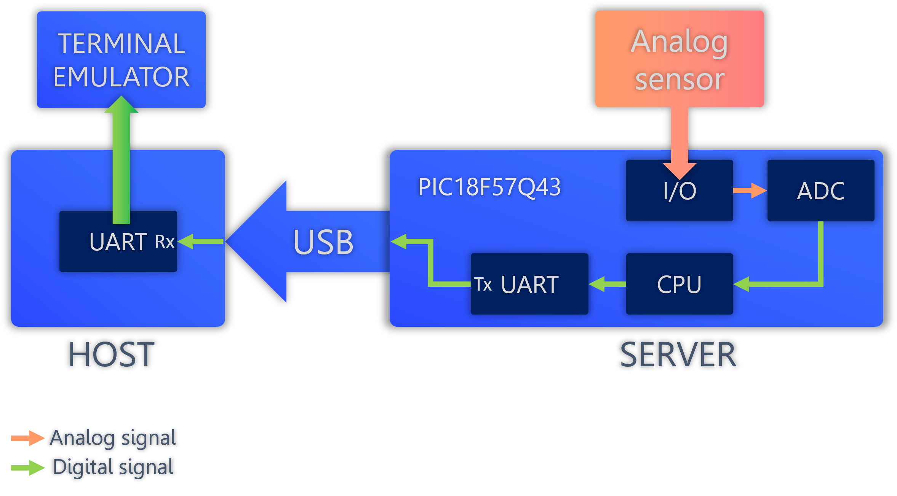

  

# __TE2015 Final Project__

## __Introduction__
This is the final project of the course. Here you will code a nice application for your PIC18 MCU that puts into practice most of the relevant topics we coveded on our course. This project involves the use of an analog sensor (or just a simple potentiometer) to 1) input an analog signal to the MCU's analog-to-digital converter to be sampled, 2) and then to transmit the corresponding digital signal to your personal computer (called host for this purpose) through the UART peripheral on your MCU. On the host side, you will display the voltage readings on a serial terminal emulator.

This projects aims to serve as a foundation design of embedded system developments. From here, you will be able to develop more complex designs that involve microcontrollers, peripherals and communication protocols that interconnects them. 

## __Project Description__
The final goal of this project is to develop an application that uses your MCU as a server to communicate a digital signal to a host device; in this case, your personal computer. The digital signal to transmit is a string that contains the voltage value read from the sensor. The host does not transmit any data back to the server, so we only need a one-way communication channel; that is, the server only transmits (Tx) and host only receives (Rx).

  

You can use any analog sensor as soon as it can be powered by the Curiosity board's VTG power line (3.3 VDC). Some easily available sensors are optoresistors, thermistors, temperature, infrared, proximity, gas, humidity sensors, and many others. 

The peripherals and modules that you must use in your solution are:
1. Analog to Digital Converter with Computation, (ADCC) peripheral
2. Universal Asynchonous Receiver Transmitter (UART) peripheral
3. I/O ports module
4. Vectored Interrupt Controller (VIC) module

All the necessary information regarding the MCU modules for this project are found in the PIC18F57Q43 datasheet and on the corresponding class slides and recordings.

## _HARDWARE SETUP_
The wiring for the project is very simple. You just need to connect the analog output of your sensor to the Curiosity Nano AN0 pin (RA0) and make sure it is powered using VTG (3.3 V). The physical connection between server and host is made using the same USB cable you already use to program your MCU. On the host side, you just need to be aware of the communication port that is assigned to your Curiosity board by the operating system. Consider that this port might change every time you restart your PC or connect other USB devices. Use the Device Manager (on Windows) to find your Curiosity Board and its assigned port. 

We will use a terminal emulator to display voltage readings on the host side. What this emulator will do is displaying the raw data as received from the server. This means that the strings you want to display must come in formatted under the UTF-8 coding format from the server, including the voltage readings. For this, you must convert the 12-bit voltage value from the ADC output to a floating point value and then, transform the numerical value to a string. 

Once the wiring is done, you can test your setup by programming your MCU with file [TE2015_FINAL.X.production.hex](TE2015_FINAL.X.production.hex), which carries out the ADC conversion and UART transmission using an analog input at RA0.

## _ADC OPERATION_
The ADC outputs a 12-bit word that ranges from 0x000 ($0_{10}$) to 0xFFF ($4095_{10}$) which is proportional to the voltage reading at the analog input. From this value, you can determine the actual voltage value given at the analog input. For this, you must first determine the voltage value required to increment the ADC output in one step (e.g, from 0x000 to 0x001). Since the ADC has 12 bits of resolution, the total steps that the input signal is being divided by is

$$\mathrm{Voltage\;step} = \frac{V_{ref+} - V_{ref-}}{2^{12}}$$

If you use VTG and GND as positive and negative ADC references, respectively, the voltage step is 

$$\mathrm{Voltage\;step} = \frac{3.3 - 0}{4096} = 805.6 \mu V$$

This means that the ADC will increment in one unit (e.g., 0x000 to 0x001) when the analog input increments at least 805.5 microVolts (0 V to 0.0008056 V). The minimum value given by the ADC is 0x000, which corresponds to an input of 0 V. The maximum value is 0xFFF, representing an input of 4095 x 0.0008056 V = 3.3V. For a reading of 0xA49, the value would correspond to 2.1213V, and so on.

## _UART OPERATION_
The operation of the UART peripheral on the PIC18 is very straightforward once is properly configured, and you have full autonomy to configure the UART as you prefer. It is important, however, to determine from the begining the communication parameters to be used and prepare the host to receive information with the same parameters. For an asynchronous communication, these parameters include baud rate, parity bit, size of data bits, amount of stop bits, among others. Make sure you use the same set of parameters in both, UART configuration on the server side, and the terminal emulator on the host side.

## __Deliverables__
1. __[60%] Demostrative Video__

    Record a demostrative video (_7 minutes maximum_) showing the following:

    **Your solution's C code**

    1. ADC configuration. Explain the purpose of each register you used to configure the ADC
    2. UART configuration. Explain the purpose of each register you used to configure UART 
    3. Interrupts. Describe the interrupts you used in your solution and explain the interrupt service routines corresponding to each interrupt
    4. Formating. Explain the string formatting you used to transmit information over UART, including the procedure to determine the voltage value that is read from the analog sensor.

    **Hardware setup**
    1. Show your hardware setup including the analog sensor you used and its connection to the Curiosity board. Show additional connections such as LED indicators as well.

    **Terminal emulator**
    1. Show the configuration of the terminal emulator on your computer. Baud rate, package size, parity stop bits and other relevant parameters must be shown.
    2. Show the terminal emulator on your computer as it displays the voltage readings being transmitted from the server. 

    Your video must be uploaded to your favorite video platform (YouTube, TikTok, Instagram, etc.) and you will only have to submitt the link to it the corresponding Canvas activity. __Make sure to set your video as Hidden, so only people with the link to it can watch it.__

2. __[40%] MPLAB X Project__ 
  
  * All your source code must be commented to explain what each line does so it can be easily understood by others.
  * Push your __MPLAB project folder__ on a GitHub repository. __Do not compress the project folder__. You must directly push the full project folder and files in their original format using Git.
  * Share the link to your Final Project repository on Canvas
  * Make sure to set your video as Private, so only those with the link to it can watch it.

The due date for the Final Project is __Saturday, December 3, at 23:59 pm__. Submit your solution:

